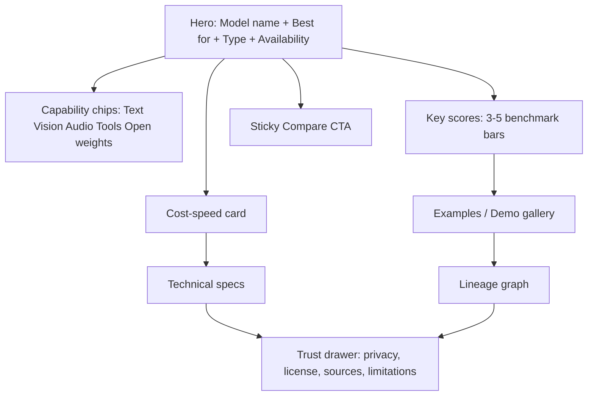
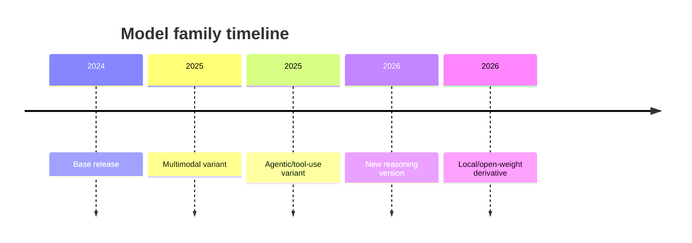

# AI Model Detail Pages That Users Actually Want

## Executive summary

Across current model-selection surfaces from entity["company","OpenAI","ai company"], entity["company","Anthropic","ai company"], and entity["company","Google","technology company"], the information shown first is not a giant spec sheet. It is a decision set: **what the model is best for, modality, price, speed/latency, context or input limits, and availability/status**. Independent benchmarking surfaces from entity["organization","Artificial Analysis","ai benchmark org"] reinforce the same pattern: people choose models by use case, then trade off quality, price, speed, latency, and context window. citeturn27view2turn35view0turn21view3turn21view7turn12view7

The best model page for AI Evolution Tree should therefore answer five questions in under ten seconds: **What is it? What is it good at? How good is it on the relevant task? What does it cost to run and how fast is it? Can I trust and deploy it in my environment?** That aligns with model-card guidance from entity["company","Hugging Face","ai platform"] and the original model-card literature, which emphasize intended uses, limitations, datasets, evaluation results, and technical details as the core transparency payload. citeturn11view5turn11view6turn11view7turn10view0turn10view1

The page should be **dynamic by model type**. An LLM page should foreground reasoning, coding, context, and tool use. An agentic model should foreground actions, environments, and workflow benchmarks. An image model should foreground gallery, editing/text rendering, and human-preference scores. An embeddings model should foreground retrieval quality, dimension, input length, and storage/runtime footprint. The same fixed template for every modality will feel wrong because the benchmark ecosystems and operating constraints are genuinely different. citeturn28view0turn31view2turn9view9turn31view1turn31view5turn30view0turn30view1

The benchmark layer should show **only 3–5 relevant scores**, with timestamps and sources. Do **not** invent a universal score. Public evidence shows why: some benchmarks drift or saturate over time, and web-enabled agent benchmarks can be contaminated. That means model pages need source-level trust labels and “last verified” metadata, not just numbers. citeturn29view0turn29view1turn29view2turn15view1

## Research basis and design principles

This recommendation is based on convergent patterns across vendor docs, benchmark hubs, model-card frameworks, deployment docs, and transparency materials from entity["company","Microsoft","technology company"], entity["company","Amazon Web Services","cloud provider"], and entity["organization","NIST","us standards body"]. Current vendor pages surface capability, context or input limits, pricing, latency, tool support, and lifecycle state; model-card frameworks require intended uses, limitations, training data, and evaluation results; cloud docs add deployment, regions, SLAs, and privacy controls. citeturn27view2turn35view0turn21view3turn11view0turn11view1turn11view5turn11view7turn13view6turn15view5turn13view2turn9view15

From that evidence, five design principles follow.

First, **start with use case, not architecture**. Artificial Analysis explicitly recommends starting with the use case because quality, price, speed, latency, and context trade off differently depending on the workload. citeturn21view7turn12view8

Second, **show evidence, not adjectives**. “Most capable,” “frontier,” or “best price-performance” are useful marketing summaries, but users still need benchmark provenance, methodology, and recency to interpret them. citeturn21view6turn35view0turn12view3turn15view1

Third, **separate model facts from deployment facts**. The same model can differ by route or provider on latency, price, region, endpoint type, retention, and SLA. citeturn12view7turn35view0turn15view3turn15view4turn15view5

Fourth, **treat privacy, licensing, and provenance as first-class product information**. Model cards and dataset cards explicitly call for intended use, limitations, biases, datasets, and evaluation results; enterprise deployment docs add retention, zero-data-retention, and training restrictions as practical buying criteria. citeturn10view0turn11view5turn11view7turn26view0turn26view1turn10view7turn23view0turn23view2

Fifth, **always display lifecycle and currency**. Vendors now expose deprecations, preview/stable naming, and shutdown timelines, so the page should never imply a model is equally current, stable, or recommended when it is not. citeturn27view4turn27view5turn27view0

## Prioritized field system

The field list below is the highest-leverage version of a model page for AI Evolution Tree. It assumes you want a single schema that can drive LLM, agentic, multimodal, image, video, audio, and embeddings pages, while rendering only what is relevant for each model type.

| Field | Recommended UI label | Priority | Show for | Why it matters |
|---|---|---|---|---|
| Model name + exact variant | **Model** | Hero | All | Anchor identity; exact version matters for reproducibility |
| One-line use-case summary | **Best for** | Hero | All | Fastest “fit” decision |
| Model family / type | **Type** | Hero | All | Distinguishes LLM vs agent vs image vs video vs audio vs embeddings |
| Input/output modalities | **Input → Output** | Hero | All | Prevents mismatched expectations |
| Availability state | **Available as** | Hero | All | API, open weights, local, preview, deprecated, gated |
| Top benchmark snapshot | **Key scores** | Hero | All | Replaces vague capability adjectives with evidence |
| Price | **Pricing** | Hero | Hosted/API/media models | Top purchase criterion |
| Speed / latency | **Speed** | Hero | API, realtime, generation, STT/TTS | Determines UX viability |
| Max input/output limit | **Context** / **Max audio** / **Max video** / **Max resolution** / **Vector size** | Hero | All, label dynamically | Feasibility constraint for real tasks |
| Tool or action support | **Tools & actions** | Hero | Agentic, tool-using LLMs | Core differentiator for workflow automation |
| Deployment options | **Deploy where** | Hero | All | Local vs cloud vs Bedrock/Vertex/Azure matters operationally |
| Provider / lab | **Developer** | Secondary | All | Provenance and trust context |
| API and SDK access | **API access** | Secondary | API models | Integration friction |
| Release date + lifecycle | **Release status** | Secondary | All | Stable / preview / shut down / deprecated |
| Lineage / base model | **Lineage** | Secondary | All | Comparison and family-tree value |
| Open-source / open-weights / closed | **Openness** | Secondary | All | Major adoption and governance signal |
| License | **License** | Secondary | Open and downloadable models | Legal reuse boundary |
| Community/open rank | **Open-weight rank** | Secondary | Open/open-weight models | Helps local/open-source users choose quickly |
| Data provenance / training disclosure | **Training data disclosure** | Secondary | All if disclosed | Trust, auditability, legal context |
| Privacy and retention | **Data handling** | Secondary | API/cloud/integrated products | Enterprise blocker or enabler |
| Safety and limitations | **Known limits** | Secondary | All | Avoids misuse and overtrust |
| Language / locale support | **Language support** | Secondary | Text/audio/embeddings | Practical coverage question |
| Knowledge cutoff / freshness | **Knowledge date** | Secondary | LLMs and reasoning models | Important for current-events expectations |
| Runtime footprint | **Hardware needs** / **Embedding dimension** | Secondary | Open weights, media, embeddings | Local deploy/storage cost |
| Sample prompts / recipes | **Starter recipes** | Secondary | All | Converts interest into immediate use |
| Demo / sample outputs | **Try it** / **Examples** | Secondary | Especially image, video, audio, multimodal | Users trust what they can see or hear |
| Methodology and sources | **How these scores were measured** | Tertiary | All | Needed for reproducibility and credibility |
| Changelog / version history | **Version history** | Tertiary | All | Helps users understand evolution and migration |

This structure is justified by the common metadata and documentation fields recommended by Hugging Face model cards and release checklists; by the original model-card framework; and by the field sets visible in current vendor model catalogs, which prominently include pricing, latency, context, capabilities, IDs, tool support, and status. citeturn11view0turn11view1turn11view3turn11view5turn11view6turn10view0turn10view1turn27view2turn35view0turn21view3

A practical page rule is simple: **keep only 8–10 fields in the hero**, move operational and trust details into secondary cards or a right-side drawer, and leave full methodology/changelog fields below the fold. That best matches how model pages are used in practice: quick triage first, documentation second. citeturn21view7turn11view0turn15view0

## Benchmark system and dynamic display rules

A good model page should show **3–5 benchmark or KPI cards** chosen by modality. It should not show generic benchmarks that users cannot map to their task. This matters even more now because some benchmark families drift, saturate, or become contaminated over time. citeturn29view0turn29view1turn29view2

### Suggested benchmark and KPI set by modality

| Modality | Default 3–5 benchmarks / KPIs to show | Use these labels on page | Display rule |
|---|---|---|---|
| Text LLM | Artificial Analysis Intelligence Index; SWE-bench Verified; AA-LCR; GPQA Diamond or HLE; arena preference if enough votes | **Overall reasoning**, **Real coding**, **Long-context**, **Frontier reasoning**, **Human preference** | Default show 3: overall, coding, context. Add frontier reasoning and arena only when credible data exists |
| Agentic | Terminal-Bench; BrowseComp; WebArena / VisualWebArena; OSWorld; APEX-Agents-AA or equivalent knowledge-work eval | **Terminal tasks**, **Web research**, **Browser workflows**, **Computer use**, **Knowledge work** | Choose 3–4 based on subtype: browser, terminal, research, or computer-use |
| Multimodal understanding | MMMU / MMMU-Pro; DocVQA; ChartQA / ChartQAPro; Video-MME; Video-MMMU | **Visual reasoning**, **Document QA**, **Chart reasoning**, **Video understanding**, **Video reasoning** | Render only for supported media; do not show video scores on image-only models |
| Image generation / editing | Artificial Analysis Image Arena Elo; GenEval or GenEval 2; PickScore / Pick-a-Pic; Image Editing Elo when editing is supported | **Human preference**, **Prompt fidelity**, **Preference model**, **Editing quality** | For editing models, swap in image-editing Elo; keep total visible cards to 3–4 |
| Video generation | Artificial Analysis Video Arena Elo; VBench; audio-enabled arena Elo when relevant; generation speed; price per minute | **Human preference**, **Video quality**, **Audio sync**, **Generation speed**, **Cost** | Public benchmark coverage is thinner here, so pair 2 quality benchmarks with 1–2 operational KPIs |
| Audio STT | Artificial Analysis AA-WER; FLEURS; transcription speed factor; price per 1,000 minutes | **Transcription accuracy**, **Multilingual speech**, **Speed**, **Cost** | Use for speech-to-text and meeting transcription models |
| Audio TTS | Artificial Analysis Speech Arena Elo; MOS/CMOS if available; synthesis latency; price per 1M characters | **Naturalness**, **Human rating**, **Realtime speed**, **Cost** | Use for TTS and voice-generation models |
| Audio-language / speech reasoning | AIR-Bench; FLEURS where ASR matters; end-to-end turn latency | **Audio understanding**, **Speech coverage**, **Turn speed** | Use for audio-in/audio-reasoning models, not basic TTS |
| Embeddings / retrieval | MTEB; BEIR; MIRACL; max input length; vector dimension / storage footprint | **Embedding quality**, **Zero-shot retrieval**, **Multilingual retrieval**, **Max length**, **Vector size** | Default show 3 quality cards and 1 operational card |

The benchmark choices above are grounded in the benchmark ecosystems themselves: Artificial Analysis aggregates reasoning, coding, long-context, and agentic evaluations; SWE-bench measures patching real GitHub issues; MMMU targets expert-level multimodal reasoning; DocVQA targets document QA; VBench decomposes video-generation quality into 16 dimensions; Video-MME and Video-MMMU focus on video understanding; FLEURS covers multilingual speech tasks; AIR-Bench targets audio-language understanding; MTEB spans eight embedding task families; and BEIR and MIRACL cover robust and multilingual retrieval. citeturn28view0turn9view6turn31view2turn9view9turn31view1turn31view3turn31view0turn31view6turn30view0turn30view1turn33search0

### Dynamic display rules by model type

For a **text LLM**, the hero should show Best for, price, speed, context, overall reasoning, coding, and long-context. Tool support belongs in the hero only if the model exposes functions, web search, file search, or computer use. This mirrors current vendor compare pages, which already foreground those fields. citeturn27view2turn35view0

For an **agentic model**, promote **Tools & actions**, **Deploy where**, and the environment-specific benchmarks above price. Agent users care less about pure chat quality and more about whether the model can finish a browsing, terminal, or computer-use workflow. citeturn17search0turn17search1turn17search2turn17search3

For a **multimodal model**, replace some text-centric cards with **Input → Output**, **Doc reasoning**, **Vision reasoning**, and a sample image/PDF/video task. Google’s prompt gallery is a strong clue here: the most legible use cases are task-shaped, not benchmark-shaped. citeturn15view2turn12view9

For an **image model**, move **gallery and example outputs above long-form specs**. Human preference and prompt fidelity matter more than token context. For an **image-editing** model, show edit-quality evidence and before/after examples, not just generation examples. citeturn32view2turn18search19

For a **video model**, the page should feel like a media product page: hero clip, duration/resolution/audio support, human-preference score, and generation speed. Avoid generic “reasoning” badges unless it is also a video-understanding model. citeturn19search0turn19search6turn31view1

For **audio**, split the page logic by subtype. STT pages should lead with WER, language support, and speed. TTS pages should lead with naturalness and playable samples. Live/audio-language pages should lead with turn latency and audio understanding. citeturn31view5turn32view0turn31view6

For **embeddings**, do not waste hero space on chat-oriented prompt demos. Show vector dimension, max input length, MTEB/BEIR/MIRACL, supported languages, and storage/runtime footprint first. citeturn30view0turn30view1turn33search0

## UI components and copy system

The page should feel like a **decision cockpit**, not a wiki. The best layout is a fast-scanning hero, benchmark evidence block, examples/demos, then ops/trust details in secondary layers.

### Recommended components

| Component | Purpose | Copy example | Notes |
|---|---|---|---|
| Hero decision card | Immediate fit decision | **Best for** long-context coding and research agents | Keep to one sentence |
| Capability chips row | Quick scan | **Text**, **Vision**, **Tools**, **API**, **Open weights** | Use small monochrome chips |
| Benchmark bars | Evidence at a glance | **Overall reasoning 87**, **Real coding 74**, **Long-context 91** | Normalize visually, preserve raw score on hover |
| Cost-speed mini chart | Practical tradeoff | **Fast**, **$3 / input MTok**, **$15 / output MTok** | For generations, use per image / per min / per hour |
| Lineage graph | “Where it came from” | **Built on Llama 3.3 → fine-tuned for code** | Strong fit for AI Evolution Tree branding |
| Demo / sample outputs panel | Sensory trust | **Try a sample prompt** / **Listen to a sample voice** / **View example generations** | Mandatory for image, video, audio |
| Sticky compare CTA | Encourage utility | **Add to compare** / **Compare with Claude Sonnet 4.6** | Keep in viewport during scroll |
| Right-side trust drawer | Governance without clutter | **Official pricing • Independent benchmarks • Last verified Apr 28, 2026** | Great place for sources, limitations, privacy, license |
| Secondary specs accordion | Detail without overload | **Technical details** | Expand only when needed |

This component system lines up with what Hugging Face already exposes effectively through model cards, eval widgets, and linked demos/Spaces, and with the task-oriented sample workflows shown in Google’s prompt gallery. citeturn15view0turn15view1turn15view2

### Concise microcopy for top fields

These labels should sound human, not database-like.

| Field | Recommended microcopy |
|---|---|
| Best for | **Best for** long-context coding, research, and doc-heavy agents |
| Type | **Type** multimodal reasoning model |
| Available as | **Available as** API, Bedrock, Vertex AI, Foundry |
| Pricing | **Pricing** $3 / input MTok • $15 / output MTok |
| Speed | **Speed** fast enough for chat; not ideal for live voice |
| Context | **Context** 1M-token input window |
| Tools & actions | **Tools & actions** functions, web search, file search, computer use |
| Openness | **Openness** open weights, not OSI-open-source |
| Data handling | **Data handling** API supports zero data retention |
| Known limits | **Known limits** may hallucinate on niche factual lookups |
| Knowledge date | **Knowledge date** most reliable through Jan 2026 |
| Training data disclosure | **Training data disclosure** not publicly detailed |
| Try it | **Try it** run a sample prompt or compare example outputs |
| Trust line | **Verified by** official docs and linked benchmarks |

### Visual suggestions

Use a restrained icon set:

- **Brain** for reasoning  
- **Brackets** for coding  
- **Eye** for vision  
- **Film** for video  
- **Mic** for audio  
- **Vector / nodes** for embeddings  
- **Shield** for privacy and safety  
- **Unlock** for openness/license  
- **Cloud / laptop** for deployment  
- **Clock / lightning** for latency

Good mini-charts include a **horizontal benchmark bar group**, a **price-vs-speed quadrant**, a **context/input-limit ruler**, and a **version timeline**. Those encode the real decisions users make much better than a dense attributes table. citeturn12view7turn15view1

## Sourcing, trust badges, and implementation rules

### Source priority

Your source stack should be strict and explicit.

1. **Official vendor docs and system/model cards first.** Use those for model IDs, pricing, context windows, latency labels, modalities, lifecycle states, privacy terms, and deployment support. citeturn27view2turn35view0turn21view3turn23view0turn23view1turn23view2

2. **Official benchmark sites or papers second.** Use benchmark maintainers for what a benchmark actually measures. citeturn9view6turn31view2turn9view9turn31view1turn31view3turn31view0turn31view6turn30view0turn30view1

3. **Independent benchmark aggregators third.** Use Artificial Analysis for cross-model comparisons on reasoning, price, speed, STT, TTS, image, and video, but always keep the original benchmark source link when available. citeturn28view0turn31view5turn32view0turn32view2turn19search0

4. **Hugging Face model cards, dataset cards, and eval widgets fourth.** These are excellent for license, dataset links, base-model lineage, eval widgets, and demos, but quality varies because many cards are author-maintained. citeturn11view7turn15view1turn15view0turn26view0

5. **Vendor blogs and news only after that**, and clearly marked as self-reported or contextual.

### Verification model

Adopt a visible badge taxonomy.

- **Verified by official docs** — source is official model docs, pricing docs, system card, trust center, or cloud catalog  
- **Independently benchmarked** — source is benchmark maintainer or independent benchmarker such as Artificial Analysis  
- **Self-reported by vendor** — source is vendor blog, launch page, or marketing claim without linked methodology  
- **Community-reported** — source is arena votes, open leaderboard submissions, or Hub metadata  
- **Derived / normalized by AI Evolution Tree** — your own derived score, rank, or label from raw fields

This is important because transparency and accountability docs explicitly distinguish intended uses, limitations, datasets, and evaluation methods, and because benchmark integrity can degrade over time. citeturn10view1turn24view0turn29view0turn29view1

### Privacy and trust badges

Privacy is **not** a single model attribute. It is frequently a **deployment-surface attribute**. Your page should label that clearly.

Recommended badge system:

- **Zero data retention available**
- **No training on customer data**
- **Training on free-tier/dev surface**
- **Data residency controls**
- **HIPAA-ready API**
- **Enterprise key management**
- **Search grounding stores prompts**
- **Consumer surface differs from API**

These badges are grounded in the fact that privacy terms vary sharply by surface. For example, OpenAI API abuse-monitoring logs are retained for up to 30 days by default, while eligible business customers can use configurable retention and zero-data-retention policies; Anthropic offers ZDR, data-residency controls, and HIPAA-ready API access; and Vertex AI says customer data is not used to train or fine-tune models without permission, while some grounding features store prompt/context data for 30 days. Google’s free AI Studio / Gemini API entry path also explicitly notes that free usage content may be used to improve products. citeturn10view7turn15view7turn23view0turn23view1turn26view3turn24view3turn26view2turn12view5

### Openness badges

Do not collapse “open” into one label. Use the terminology from the entity["organization","Open Source Initiative","opensource standards body"].

- **Open source AI** — only when code, data information, and model/weights satisfy the OSI definition  
- **Open weights** — weights released, but training code and full data disclosure not necessarily included  
- **Closed model** — API or product access only

That distinction matters because OSI explicitly says open-source AI requires the data information and code used to derive the parameters, while its “open weights” guidance says released weights alone are only partial transparency. citeturn24view6turn25view0

### Data model implementation guidance

For each field in your database, store:

- `value`
- `display_label`
- `source_name`
- `source_type`
- `source_url`
- `verified_status`
- `applies_to_surface`  
  e.g. first-party API, Azure, Bedrock, Vertex, local
- `last_verified_at`
- `effective_date`
- `notes`
- `confidence`

That lets your UI show “official,” “independent,” “self-reported,” and “last checked” without extra editorial work.

## Wireframes and limitations

### Sample mockup wireframe

### Sample lineage timeline

### Open questions and limitations

The biggest unresolved design area is **image/video/audio benchmarking**, because public benchmark quality is more fragmented there than for text LLMs and embeddings. The safest approach is to combine 2–3 credible external benchmarks with a few plain operational KPIs instead of forcing a fake universal score. That is especially important because newer work is already documenting benchmark drift and saturation in media evaluation. citeturn29view1turn29view2turn31view1

The second limitation is **deployment variance**. A “model page” can mislead if it treats one model as a single object when price, latency, regional routing, retention, and availability vary by provider. The fix is to separate **model facts** from **provider/deployment facts** in the UI and database. citeturn12view7turn15view3turn15view4turn35view0

The most practical conclusion is this: for AI Evolution Tree, the ideal model page is **not encyclopedia-first**. It is **decision-first, proof-backed, and modality-aware**. That is what the best current model docs, benchmark hubs, and transparency frameworks all converge on. citeturn21view7turn11view5turn10view0turn15view1